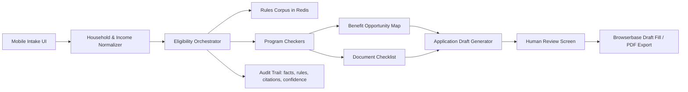

# Benefits Navigator Win Spec

Working title: **BridgeBenefits**

One-liner:

> BridgeBenefits is a trust-first benefits co-pilot that screens a family for public and local assistance, cites the exact eligibility rules it used, builds a document checklist, and drafts applications for human review before submission.

## Why This Problem Hurts

Low-income families are not missing benefits because they are lazy or unaware in some vague way. They are navigating a system that is fragmented, high-stakes, and punishing when you make small mistakes.

The pain is a bundle of hard problems:

| Pain | What It Means For Users |
|---|---|
| Program discovery | Families may qualify for food, health, child care, utility, housing, school, and local nonprofit programs, but each lives in a different place. |
| Eligibility complexity | Income, household size, immigration status, disability, pregnancy, student status, county, expenses, assets, and documents all matter. |
| Form fatigue | People repeat the same household/income information across portals. |
| Missing document denials | Applications can fail because caseworkers do not have enough information, not because the family is truly ineligible. |
| Mobile-first reality | Many users rely on phones, borrowed devices, or unstable internet. |
| Trust gap | A wrong AI answer can cause real harm: missed benefits, wasted time, disclosure of sensitive information, or false confidence. |

The strongest hackathon framing:

> The safety net already exists, but families fall through the cracks because eligibility rules and application workflows are too hard to navigate. BridgeBenefits turns those rules into auditable, human-reviewed application drafts.

## Evidence That The Pain Is Real

- Code for America says public benefits enrollment is still too complex and that clients can misunderstand requirements or submit incorrect information, delaying access and straining caseworkers.
- Their field guide says nearly 7 million SNAP-eligible people do not participate, and WIC has a nearly 50% participation gap.
- The Office of Evaluation Sciences found that in a SNAP application study, 21.1% of applicants in the basic text group were denied because caseworkers did not have enough information to evaluate eligibility.
- Code for America also found that integrated applications can reduce completion time dramatically; Oregon went from an estimated 80 minutes to as little as 15 minutes for the same benefits after streamlining.
- GetCalFresh was created because applying for SNAP in California was difficult; at the time, only 66% of eligible Californians were receiving benefits.

## Target Audience

### Primary User

Low-income families with children in California, especially users who:

- Need food, health, utility, child care, or local emergency assistance.
- Have variable income, multiple jobs, or gig work.
- Are applying on a phone.
- Are unsure which household members count.
- Need help understanding which documents to upload.
- May prefer Spanish or another language.

### Secondary User

Community benefit navigators:

- Food bank intake workers.
- School family-resource coordinators.
- Clinic social workers.
- Campus basic-needs centers.
- Nonprofit case managers.

This secondary user matters for winning because a navigator dashboard makes the project feel deployable, not just consumer-app cute.

### Hackathon Judge Audience

The judge should instantly understand:

- This helps vulnerable families get concrete money/food/health support.
- It uses AI for a hard workflow, not just chat.
- It has guardrails for eligibility, citations, PII, and human review.
- It can demo an end-to-end action loop.

## Prior Art And Differentiation

This category already exists. That is good and dangerous.

| Existing Product / System | What It Does | Gap For Us To Own |
|---|---|---|
| USAGov Benefit Finder | Asks basic questions and suggests potential government benefits | Broad discovery, not deep application drafting or rule-cited local workflows |
| Benefits.gov / state portals | Official program info and applications | Hard to use, often fragmented, not personalized enough |
| GetCalFresh | Clear CalFresh support and path to BenefitsCal | Focused on CalFresh, not multi-program benefit navigation |
| mRelief | SNAP screener and simplified application support in some states | Strong SNAP wedge, not broad California family navigator |
| findhelp / One Degree | Search local social services and referrals | Resource discovery, not eligibility reasoning plus application drafting |
| Propel | EBT balance, updates, savings, benefit management | Post-enrollment management, not application preparation |
| BenefitsCheckUp | Connects older adults and disabled people to benefits | Different audience; less focused on families and application automation |

The differentiation should be:

> BridgeBenefits does not just list programs. It produces an auditable eligibility map, cites the exact rules, builds a missing-document checklist, and drafts the application packet with a human-controlled submit step.

## Scope To Win In 24 Hours

Do **not** build a national all-benefits platform. Build one trusted vertical slice.

Recommended demo scope:

- Location: Berkeley/Oakland/Alameda County, California.
- Persona: single parent with two kids, variable monthly income, high rent, one child under 5.
- Programs:
  - CalFresh.
  - Medi-Cal / CHIP.
  - WIC.
  - Utility or local emergency assistance.
  - One local food/housing/community resource from findhelp-style seeded data.

This is enough to show multi-program complexity without drowning the team.

## Core Product Loop

1. User answers a short guided intake.
2. System normalizes household, income, expenses, location, and special statuses.
3. Eligibility engine checks each program against a rules corpus.
4. UI shows likely eligible, maybe eligible, missing info, and likely not eligible.
5. Every conclusion has cited rule snippets and a confidence level.
6. System creates a document checklist.
7. Agent drafts application answers and/or fills a demo portal in Browserbase.
8. User reviews every answer.
9. User downloads/submits only after explicit confirmation.

## MVP Features

### Must Build

| Feature | Why It Matters | Hackathon Version |
|---|---|---|
| Guided intake | Makes the app accessible and reduces wrong inputs | Mobile-first form with plain-language questions |
| Household/income normalizer | The backend work that makes this more than a chatbot | Convert raw answers into structured JSON |
| Rule-cited eligibility engine | Trust spine of the product | RAG + deterministic checks over a small program corpus |
| Benefit opportunity map | Gives users a clear path | Cards: likely, maybe, missing info, not likely |
| Document checklist | Directly addresses procedural denials | Generate per-program required/maybe-needed documents |
| Draft application packet | Produces a concrete outcome | Generate PDF/JSON packet and form-field draft |
| Human review gate | Prevents dangerous automation | Never auto-submit; explicit "review and continue" step |
| Audit trail | Wins judge trust | Show every decision, source, rule, and user-provided fact |

### Should Build If Time

| Feature | Why It Helps |
|---|---|
| Browserbase portal drafting | Strong sponsor and demo value: agent fills a real-looking portal draft |
| Spanish toggle | Strong accessibility/social-impact signal |
| Navigator mode | Lets a community worker review multiple cases |
| Document photo upload | Strong demo: phone photo to checklist matching |
| Benefits cliff explainer | Shows how income changes may affect benefits |
| SMS/email reminder draft | Helps users complete interviews/document deadlines |

### Do Not Build

| Temptation | Why Not |
|---|---|
| Full national coverage | Too broad and brittle |
| Real application submission | High risk; not needed to win |
| Eligibility guarantees | Unsafe and legally sketchy |
| Auth/user accounts | Usually not needed for the demo |
| Too many programs | More programs means more ways to be wrong |

## Trust And Safety Rules

These should be visible in the product and in the pitch.

| Risk | Product Rule |
|---|---|
| Wrong eligibility answer | Say "likely eligible" or "may be eligible," cite rules, and route uncertain cases to apply or talk to a human navigator. |
| Hallucinated policy | Model cannot answer eligibility unless it can cite a rule from the corpus. |
| Prompt injection from web pages | Treat portal/webpage text as untrusted content; never let it override system instructions. |
| Accidental submission | Browser agent can draft/fill, but user must review and click submit. |
| Sensitive data exposure | Store only demo data by default; redact SSNs and document IDs; show deletion controls. |
| User misunderstanding | Use plain language, examples, and "why we ask this" tooltips. |
| Overpromising | Add a clear disclaimer: final eligibility is determined by the administering agency. |

## Suggested Architecture



## Backend Shape

Use a strict schema so the app feels serious.

```json
{
  "household": {
    "county": "Alameda",
    "members": 3,
    "children_under_5": 1,
    "monthly_income": 2850,
    "monthly_rent": 2100,
    "utilities": true
  },
  "program_results": [
    {
      "program": "CalFresh",
      "status": "likely_eligible",
      "confidence": 0.78,
      "matched_rules": ["income_rule_2026_ca_calfresh", "household_rule_shared_food"],
      "missing_info": ["citizenship_or_eligible_immigration_status", "exact_pay_frequency"],
      "recommended_next_step": "Draft BenefitsCal answers for user review"
    }
  ]
}
```

## Demo Script

The demo should be built before the code is fully finished.

### 15 Seconds: Problem

"Millions of people qualify for public benefits but never receive them because eligibility rules, documents, and application portals are confusing. A wrong AI answer can hurt them, so BridgeBenefits makes every eligibility suggestion auditable."

### 60 Seconds: Live User Flow

Show the guided intake for a Berkeley/Oakland family. Keep it short: location, household, income, rent, children, pregnancy/child age, utilities, immigration/citizenship as optional/sensitive.

### 75 Seconds: AI + Backend

Show the eligibility map:

- CalFresh: likely eligible, with rules cited.
- WIC: likely eligible because child under 5, with income caveat.
- Medi-Cal/CHIP: maybe eligible, needs income details.
- Utility/local assistance: likely eligible or local referral.

Click one card and show the audit trail.

### 75 Seconds: Action

Generate the application packet:

- Draft answers.
- Missing documents.
- Reminder timeline.
- Browserbase fills a demo BenefitsCal-style form, but stops at review.

### 45 Seconds: Trust

Show the guardrails:

- No uncited eligibility.
- Human submits.
- PII redaction.
- Prompt injection defense.
- Export/delete data.

### 30 Seconds: Why It Wins

"This is not a chatbot. It is a rule-grounded application assistant for a real safety-net workflow. It reduces abandonment, gives navigators a reviewable packet, and keeps families in control."

## Prize Targeting

| Prize / Sponsor | Why This Fits | What To Show |
|---|---|---|
| Ddoski's World | Direct social impact and systemic inequity | Participation gap, vulnerable families, actual workflow |
| Anthropic | Economic opportunity and high-impact domain | Claude handles intake, explanation, drafting, and safe reasoning |
| Browserbase | Agent uses web portals | Browserbase fills a draft form and stops for review |
| Redis | Rules corpus, memory, vector search | Redis stores program rules, embeddings, case state, audit trail |
| Sentry | Reliability and safety | Trace errors, policy misses, browser failures |
| Arize | Evaluation | Show evals for eligibility answer faithfulness/citation correctness |
| Best UI/UX | Mobile-first, plain-language, accessible design | Beautiful intake, cards, checklist, review screen |

## What Makes This Hackathon-Winning

This idea has the same winner shape as strong past projects:

- **Specific user:** low-income families and benefit navigators.
- **Painful setting:** confusing, high-stakes public benefits applications.
- **AI capability:** rule-grounded eligibility reasoning, document extraction, application drafting, browser automation.
- **Concrete output:** eligibility map, cited explanations, document checklist, application draft.
- **Trust angle:** human review, citations, PII handling, no silent submission.
- **Demo drama:** watch an agent go from family situation to a filled application draft.

## Build Plan

### First 2 Hours

- Pick persona and exact programs.
- Create a tiny rules corpus in Markdown/JSON.
- Define the household schema and program result schema.
- Build static UI wireframes for intake, opportunity map, checklist, and review.

### Hours 2-6

- Implement intake flow.
- Implement deterministic checks for the demo programs.
- Add RAG/citation lookup over the rules corpus.
- Generate program result cards.

### Hours 6-12

- Generate document checklist and application packet.
- Add Browserbase draft-fill flow on a demo portal or real portal in non-submit mode.
- Add audit trail view.

### Overnight

- Polish UI.
- Add source/citation highlighting.
- Add Spanish/plain-language mode if feasible.
- Add fake-but-plausible navigator dashboard.

### Final Morning

- Record demo video.
- Write Devpost with screenshots and architecture diagram.
- Freeze the happy path.
- Practice the 5-minute pitch.

## Product Requirements For The Happy Path

The demo should never depend on live government portal success. Use a fallback.

| Dependency | Primary Path | Fallback |
|---|---|---|
| Program rules | Local seeded rules corpus | Static JSON fixture |
| Eligibility | Claude + deterministic validators | Deterministic validators only |
| Browserbase portal | Demo portal or staging form | PDF/HTML packet export |
| Documents | Demo uploaded pay stub/rent receipt | Preloaded examples |
| RAG citations | Redis vector lookup | Hardcoded source snippets for demo persona |

## UI Screens

1. **Welcome / trust promise:** "Find programs, understand why, review before submitting."
2. **Guided intake:** one question per screen or grouped mobile-friendly sections.
3. **Benefit opportunity map:** program cards with status, monthly/estimated value if safe, and confidence.
4. **Why am I eligible?:** cited rules, user facts used, missing facts.
5. **Document checklist:** upload/take photo/mark later.
6. **Application draft:** generated answers with editable fields.
7. **Browser draft fill:** live browser action stops before submission.
8. **Navigator review:** exportable packet, notes, next steps.

## Naming Options

| Name | Vibe |
|---|---|
| BridgeBenefits | Clear, social-impact, safe |
| AidPilot | Agentic, simple |
| BenefitBridge | Plain, maybe too generic |
| ClaimCheck | Strong audit vibe, but may sound adversarial |
| NeighborAid | Warm, less technical |

Recommended: **BridgeBenefits**.

## Final Product Stance

The project should not claim:

- "We determine eligibility."
- "We submit applications for you."
- "We replace caseworkers."

It should claim:

- "We help families understand likely eligibility."
- "We cite the rules behind every recommendation."
- "We draft applications for review."
- "We help navigators catch missing information before a denial."

## Sources

- [Code for America Benefits Enrollment Field Guide](https://codeforamerica.org/explore/benefits-enrollment-field-guide/)
- [Office of Evaluation Sciences: Decreasing SNAP denials due to incomplete information](https://oes.gsa.gov/results/decreasing-snap-denials/)
- [USAGov Benefit Finder](https://www.usa.gov/benefit-finder)
- [CalFresh, California Department of Social Services](https://cdss.ca.gov/inforesources/calfresh)
- [GetCalFresh](https://www.getcalfresh.org/en/)
- [Code for America: Reflecting on 10 Years of Food Assistance in California](https://codeforamerica.org/news/reflecting-on-10-years-of-getcalfresh/)
- [USDA ERS SNAP Key Statistics](https://www.ers.usda.gov/topics/food-nutrition-assistance/supplemental-nutrition-assistance-program-snap/key-statistics-and-research)
- [USDA FNS SNAP Participation Rates](https://www.fns.usda.gov/research/snap/national-participation-rates)
- [HealthCare.gov Medicaid & CHIP](https://www.healthcare.gov/medicaid-chip/)
- [USDA WIC](https://www.fns.usda.gov/wic)
- [mRelief](https://www.mrelief.com/)
- [findhelp](https://www.findhelp.org/)
- [One Degree](https://about.1degree.org/)
- [BenefitsCheckUp](https://benefitscheckup.org/index.html)
- [Propel](https://www.propel.app/)
